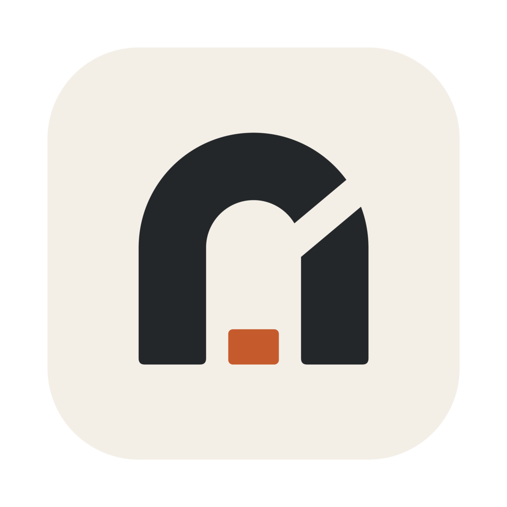
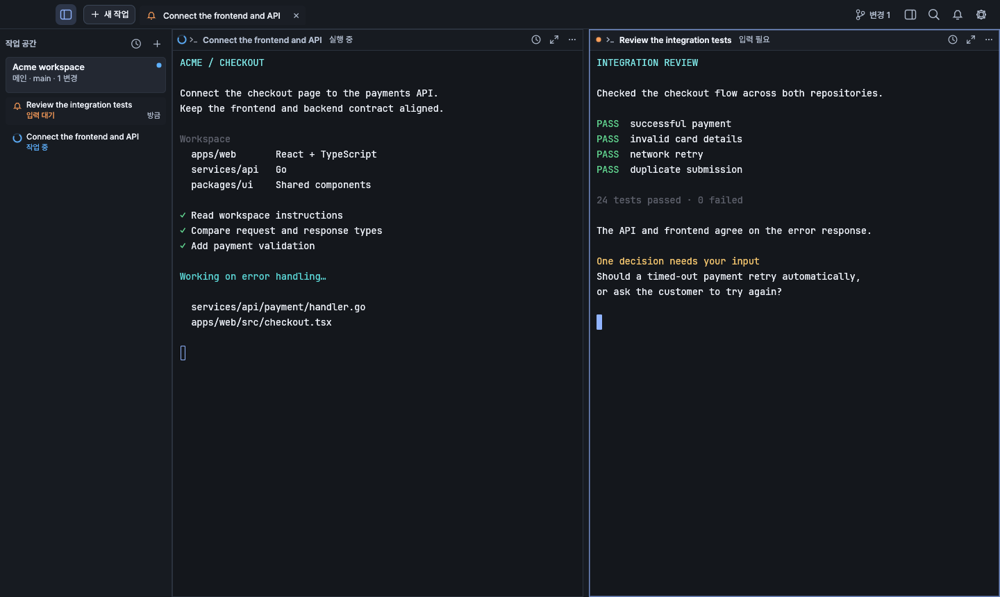

<p align="center">
  
</p>

<h1 align="center">Kiln</h1>

<p align="center">A terminal workspace for agents, code, and the work between repositories.</p>

<p align="center">
  <a href="https://github.com/YangTaeyoung/kiln/releases/latest">Download for macOS</a> ·
  <a href="docs/README.md">Documentation</a> ·
  <a href="https://github.com/YangTaeyoung/kiln/issues">Report an issue</a>
</p>

<p align="center">
  <a href="LICENSE"></a>
  
  
</p>

Kiln brings terminals, AI agents, Git, files, and databases into one native workspace.
Open a repository—or a parent folder containing your frontend, backend, and shared
libraries—and keep the whole task in view.


<sub>Rendered by Kiln with illustrative terminal content. No private workspace data.</sub>

### Keep the task together

- **Work across repositories.** Give an agent one request at the parent-folder level,
  while keeping Git operations scoped to the repository you choose.
- **See what needs attention.** Workspace task rows show reported running, waiting,
  completed, and failed states. Jump directly to the relevant split or session.
- **Keep sessions independent of the window.** A separate local daemon owns your
  terminals, so closing and reopening the GUI does not close their shells.
- **Review without leaving the workspace.** Inspect diffs and pull requests,
  drag-select commits to squash, cherry-pick from another branch, or drop a commit.
- **Use the tools around your terminal.** File editing and LSP, project search,
  SQL consoles, database grids, S3/FTP/SFTP files, SSH terminals, command history,
  and a notification center. Sign in to agent accounts through your browser.

### Start in a minute

Install the latest notarized build with one command:

```sh
curl -fsSL https://raw.githubusercontent.com/YangTaeyoung/kiln/main/install.sh | sh
```

Open **Kiln** from Applications, choose your project folder, and start a terminal
or a task with Codex or Claude. Prefer a download? Get the app from
[Releases](https://github.com/YangTaeyoung/kiln/releases/latest) and move it to Applications.
Already installed? Use **Kiln → Check for Updates**.

Requires macOS 11+ on Apple Silicon. Codex, Claude, and `gh` are external tools;
install and authenticate the ones you use. The app UI supports Korean, English, Japanese and Simplified Chinese.

[Installation and updates →](docs/getting-started.md)

### Explore

[Workspaces & agents](docs/workspaces.md) · [Git workflows](docs/git.md) ·
[File editor](docs/editor.md) · [Database tools](docs/databases.md) ·
[Remote files & SSH](docs/remote-files.md) · [Agent accounts](docs/accounts.md) ·
[Terminal integration](docs/terminal-integration.md) · [Architecture](docs/architecture.md)

### Build and contribute

```sh
git clone https://github.com/YangTaeyoung/kiln.git
cd kiln
cargo run -p kiln -- /path/to/workspace
```

See [development](docs/development.md) for prerequisites and tests. Maintainers and
AI contributors should start with [AGENTS.md](AGENTS.md), then follow the
[release runbook](docs/maintainers/releases.md).

### License

[MIT](LICENSE) © 2026 Taeyoung Yang. Bundled assets and dependencies retain their
own licenses; see [third-party notices](THIRD_PARTY_NOTICES.md).
